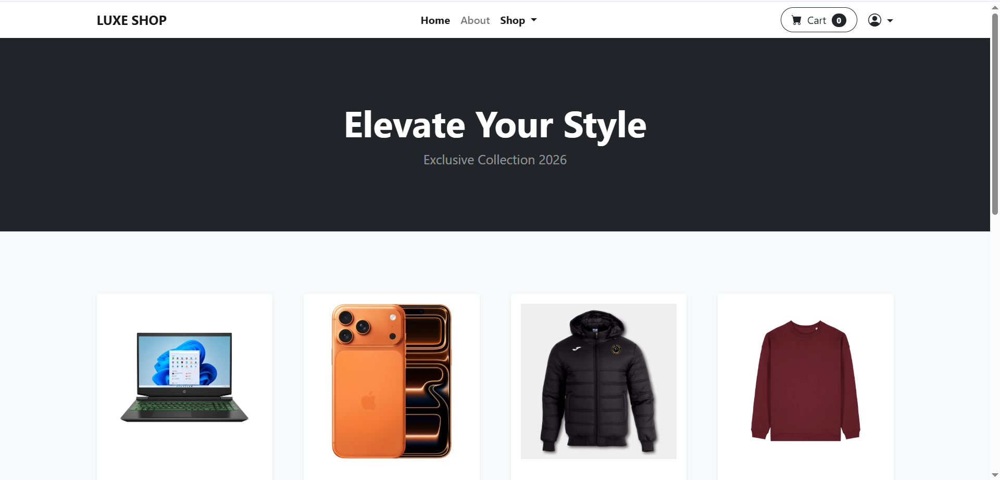
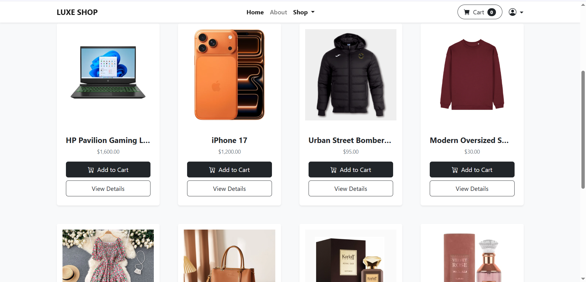
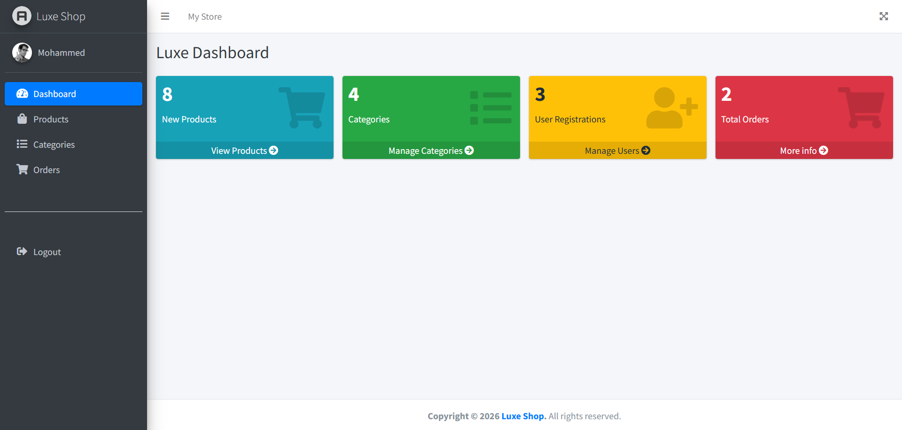

<div align="center">

# 🛍️ Luxe E-Commerce

**A modern e-commerce web application with a customer storefront and an administration dashboard.**
[Features](#-features) · [Technology](#️-technology) · [Installation](#-installation) · [Screenshots](#-screenshots) · [Author](#-author) 
</div>

---

## 📖 About the Project

Luxe E-Commerce is a full-stack online store that allows customers to browse products, view product details, add items to a shopping cart, and place orders. The project also provides a protected dashboard for managing the store's products, categories, orders, and users.

This project was built as a portfolio project to demonstrate practical e-commerce workflows and dashboard management.

## ✨ Features

### Customer Experience

- Browse a paginated product catalog.
- View product details, images, categories, and related products.
- Discover recently added products.
- Create an account, sign in, reset a password, and manage a profile.
- Add products to a shopping cart or remove them from it.
- Place orders with contact and delivery-address details.

### Administration Dashboard

- View store statistics.
- Create, edit, restore, and permanently delete products.
- Create, edit, restore, and permanently delete product categories.
- View customer orders and their item details.
- View registered users.
- Restrict dashboard access by user role.

## 🛠️ Technology

- **Backend:** PHP 8.2, Laravel 12, Eloquent ORM
- **Frontend:** Blade templates, Tailwind CSS, Alpine.js
- **Database:** SQLite by default; configurable for MySQL
- **Tools:** Vite, npm, Composer, Git
- **Image processing:** Intervention Image

## 🚀 Installation

## 🖼️ Screenshots

| Home Page | Product Details | Admin Dashboard |
| :---: | :---: | :---: |
|  |  |  |

### Requirements

- PHP 8.2 or later
- Composer
- Node.js and npm
- SQLite or MySQL

### Setup

1. Download or clone the project, then open its folder.

2. Install the PHP and JavaScript dependencies:

   ```bash
   composer install
   npm install
   ```

3. Create the environment file and application key:

   ```bash
   cp .env.example .env
   php artisan key:generate
   ```

   On Windows PowerShell:

   ```powershell
   Copy-Item .env.example .env
   php artisan key:generate
   ```

4. Configure the database in `.env`.

   For SQLite, create an empty file named `database.sqlite` inside the `database` folder and set:

   ```env
   DB_CONNECTION=sqlite
   DB_DATABASE=database/database.sqlite
   ```

5. Create the database tables and starter data:

   ```bash
   php artisan migrate --seed
   ```

6. Build the frontend assets and start the application:

   ```bash
   npm run build
   php artisan serve
   ```

Open [http://127.0.0.1:8000](http://127.0.0.1:8000) in your browser.

### Development Mode

Run these commands in separate terminals while developing:

```bash
php artisan serve
npm run dev
```

Alternatively, run the bundled development command:

```bash
composer run dev
```

## 🧭 Project Areas

| Area | Description |
| --- | --- |
| Storefront | Product catalog, new arrivals, product details, and related products |
| Account | Registration, authentication, password recovery, email verification, and profile management |
| Cart & Checkout | Session-based cart, item removal, and order placement |
| Dashboard | Store statistics and management of products, categories, orders, and users |

## ✅ Testing

Run the automated test suite with:

```bash
php artisan test
```

## 🔒 Security

- The `.env` file is excluded from version control.
- Do not upload database credentials, API keys, payment keys, or real customer data.
- Use only safe sample data in public demonstrations.

## 📄 License

This project is available for portfolio and educational purposes.

---

## 👨‍💻 Author

**Yousef Matar**

- GitHub: [@matar-yousef](https://github.com/matar-yousef)
- LinkedIn: [Your Profile Name](https://www.linkedin.com/in/yousef-matar-28264a422/)
- Email: [dev.yousef.matar@gmail.com] 
